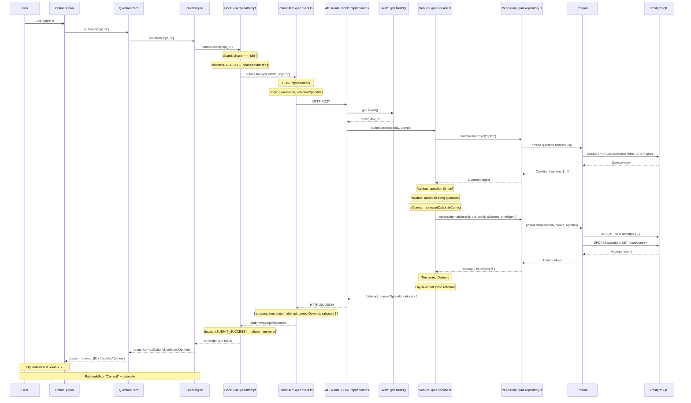

# Quiz Data Flow — Giải Thích Chi Tiết Theo Layers

> File này giải thích **từng layer (tầng) kiến trúc** trong luồng xử lý khi user chọn 1 đáp án:  
> Layer là gì? Code nào thuộc layer đó? Code đó làm gì để đúng với tên gọi?  
> Từ đó hiểu được flow đi qua những đâu, input/output ra sao.

---

## Mục Lục

1. [Tổng Quan Các Layer](#1-tổng-quan-các-layer)
2. [Presentation Layer (UI Components)](#2-presentation-layer-ui-components)
3. [Hook Layer (Orchestration)](#3-hook-layer-orchestration)
4. [Client API Layer (Network)](#4-client-api-layer-network)
5. [API Route Layer (Next.js Route Handler)](#5-api-route-layer-nextjs-route-handler)
6. [Service Layer (Business Logic)](#6-service-layer-business-logic)
7. [Repository Layer (Data Access)](#7-repository-layer-data-access)
8. [Prisma ORM Layer (Object-Relational Mapping)](#8-prisma-orm-layer)
9. [Database Layer (PostgreSQL)](#9-database-layer-postgresql)
10. [Response Flow — Chiều Ngược Lại](#10-response-flow--chiều-ngược-lại)
11. [Flow Tổng Thể (Sequence Diagram)](#11-flow-tổng-thể-sequence-diagram)

---

## 1. Tổng Quan Các Layer

Khi user click chọn 1 option, dữ liệu đi qua **7 layer**, mỗi layer có 1 trách nhiệm duy nhất:

```
┌─────────────────────────────────────────────────────────────────────┐
│  1. PRESENTATION LAYER  (OptionButton → QuestionCard → QuizEngine)  │
│     "Tôi chỉ render JSX và gọi callback"                            │
├─────────────────────────────────────────────────────────────────────┤
│  2. HOOK LAYER  (useQuizEngine → useQuizAttempt)                    │
│     "Tôi quản lý state + gọi API + điều phối"                      │
├─────────────────────────────────────────────────────────────────────┤
│  3. CLIENT API LAYER  (quiz.client.ts)                              │
│     "Tôi chỉ fetch() và trả về typed Promise"                      │
├─────────────────────────────────────────────────────────────────────┤
│  4. API ROUTE LAYER  (route.ts)                                     │
│     "Tôi là HTTP endpoint, parse request + gọi service"             │
├─────────────────────────────────────────────────────────────────────┤
│  5. SERVICE LAYER  (quiz.service.ts)                                │
│     "Tôi chứa business logic, gọi repository"                      │
├─────────────────────────────────────────────────────────────────────┤
│  6. REPOSITORY LAYER  (quiz.repository.ts)                          │
│     "Tôi là data access, gọi Prisma"                               │
├─────────────────────────────────────────────────────────────────────┤
│  7. PRISMA ORM → POSTGRESQL                                         │
│     "Tôi dịch code thành SQL và gửi tới DB"                        │
└─────────────────────────────────────────────────────────────────────┘
```

---

## 2. Presentation Layer (UI Components)

### Định nghĩa

**Presentation Layer** = tầng giao diện người dùng. Chỉ render JSX từ props, không gọi API, không chứa business logic.  
Gọi hook duy nhất ở component `QuizEngine` (smart component), các component con còn lại là **dumb component** (stateless).

### File nào thuộc layer này

| File | Vai trò trong flow |
|---|---|
| `OptionButton.tsx` | Button hiển thị 1 đáp án (A/B/C/D) |
| `QuestionCard.tsx` | Card chứa question text + danh sách OptionButton |
| `QuizEngine.tsx` | Smart component duy nhất: gọi hook, render children |
| `RationaleBox.tsx` | Box hiển thị kết quả (Correct/Incorrect + rationale) |

### Code minh họa — tại sao gọi là Presentation?

**OptionButton.tsx** — chỉ render JSX từ props, không có logic:

```tsx
// File: src/features/quiz/components/OptionButton/OptionButton.tsx:22-63
export function OptionButton({ text, label, status, onSelect }: OptionButtonProps) {
  return (
    <button onClick={status === 'disabled' ? undefined : onSelect} disabled={status === 'disabled'}>
      <span>{label}</span>          {/* A, B, C, D */}
      <span>{text}</span>           {/* Nội dung đáp án */}
      {status === 'correct' && <CheckCircle2 />}   {/* Icon ✓ nếu đúng */}
      {status === 'wrong' && <XCircle />}           {/* Icon ✗ nếu sai */}
    </button>
  )
}
```

**Giải thích:**
- `text`, `label`, `status`, `onSelect` đều là **props** — không tự fetch, không tự tính toán
- `status` được tính từ **QuestionCard** (thông qua `getOptionStatus()`)
- `onSelect` là callback từ **useQuizAttempt.handleSelect** — component chỉ gọi, không biết bên trong làm gì
- Component không biết gì về API, database, hay business logic → đúng nghĩa "Presentation"

**QuizEngine.tsx** — smart component duy nhất:

```tsx
// File: src/features/quiz/components/QuizEngine/QuizEngine.tsx:17-38
export function QuizEngine(props: QuizEngineProps) {
  const {
    currentQuestion, selectedOptionId, submitting, result,
    handleSelect, handleNext,
    ...
  } = useQuizEngine(props)   // ← GỌI HOOK DUY NHẤT

  return (
    <>
      <QuestionCard                                    // Props mapping
        question={currentQuestion}
        selectedOptionId={selectedOptionId}
        correctOptionId={result?.correctOptionId ?? null}
        onSelect={handleSelect}
      />
      {result && (
        <RationaleBox
          isCorrect={result.isCorrect}
          rationale={result.rationale}
          onNext={handleNext}
        />
      )}
    </>
  )
}
```

**Giải thích:**
- QuizEngine gọi **1 hook duy nhất** (`useQuizEngine`) — đây là điểm kết nối duy nhất giữa UI và logic
- Tất cả state và handler đến từ hook, component chỉ **map props** xuống component con
- Component con không gọi hook → không phụ thuộc implementation → có thể tái sử dụng

### Dòng code bắt đầu flow

User click → **OptionButton.tsx:26**:
```tsx
onClick={status === 'disabled' ? undefined : onSelect}
```
→ `onSelect` là `() => QuestionCard.onSelect(opt.id)` (QuestionCard.tsx:56)  
→ `QuestionCard.onSelect` là `QuizEngine.handleSelect` (QuizEngine.tsx:137)  
→ `handleSelect` là `attemptHook.handleSelect` (useQuizEngine.ts:89)

---

## 3. Hook Layer (Orchestration)

### Định nghĩa

**Hook Layer** = tầng quản lý state và side-effect. Dùng React hooks (`useState`, `useReducer`, `useCallback`) để:
- Quản lý state machine của luồng trả lời (idle → submitting → answered)
- Gọi API thông qua Client API Layer
- Điều phối giữa các hooks con (orchestration)

### File nào thuộc layer này

| File | Vai trò |
|---|---|
| `useQuizEngine.ts` | **Orchestrator**: compose 3 hooks con, wire cross-cutting logic |
| `useQuizAttempt.ts` | **State machine**: quản lý flow select → submit → result |
| `useQuizQuestions.ts` | Quản lý danh sách câu hỏi + current index |

### Code minh họa

**useQuizAttempt.ts:66-80** — trái tim của flow:

```
handleSelect(optionId):
  1. GUARD: if (!question || phase !== 'idle') return
     → Tránh double click, tránh submit khi chưa có câu hỏi

  2. dispatch({ type: 'SELECT', optionId })
     → Optimistic UI: cập nhật UI ngay trước khi API trả về
     → state: phase = 'submitting', selectedOptionId = optionId

  3. const data = await submitAttempt(question.id, optionId)
     → GỌI CLIENT API LAYER (POST /api/attempts)

  4. dispatch({ type: 'SUBMIT_SUCCESS', result: data })
     → state: phase = 'answered', result = data
     → correctCount += (isCorrect ? 1 : 0)

  5. options.onStatsUpdate(currentIdx + 1, newCorrect)
     → Báo cho parent (QuizSection) cập nhật sidebar stats
```

```typescript
// File: src/features/quiz/hooks/useQuizAttempt.ts:66-89
const handleSelect = useCallback(async (optionId: string) => {
  const question = options.currentQuestion
  if (!question || state.phase !== 'idle') return             // [1] Guard

  dispatch({ type: 'SELECT', optionId })                        // [2] Optimistic

  try {
    const data = await submitAttempt(question.id, optionId)     // [3] Gọi API
    const newCorrect = state.correctCount + (data.isCorrect ? 1 : 0)
    dispatch({ type: 'SUBMIT_SUCCESS', result: data })          // [4] Success
    options.onStatsUpdate?.(options.currentIdx + 1, newCorrect) // [5] Báo stats
  } catch {
    dispatch({ type: 'SUBMIT_ERROR' })                          // [6] Error rollback
  }
}, [options.currentQuestion, options.currentIdx, state.phase,
    state.correctCount, options.onStatsUpdate])
```

**Reducer** — state machine (useQuizAttempt.ts:22-38):

```
type AttemptState = {
  phase: 'idle' | 'submitting' | 'answered'
  selectedOptionId: string | null
  result: AttemptResult | null
  correctCount: number
}

SELECT           SUBMIT_SUCCESS
idle ────────→ submitting ──────────→ answered
                 │                      │
                 │ SUBMIT_ERROR         │ CLEAR
                 └────→ idle ←──────────┘
```

**useQuizEngine.ts** — orchestrator:

```typescript
// File: src/features/quiz/hooks/useQuizEngine.ts:40-97
export function useQuizEngine(options) {
  const questionsHook = useQuizQuestions({ type, difficulty, initialQuestions })
  const attemptHook = useQuizAttempt({
    currentQuestion: questionsHook.currentQuestion,  // ← lấy từ questionsHook
    currentIdx: questionsHook.currentIdx,
    onStatsUpdate: options.onStatsUpdate,
  })
  const importHook = useQuizImport({
    type: options.type,
    onImportQuestions: (questions) => {
      questionsHook.setQuestions(questions)
      questionsHook.resetIdx()
      attemptHook.clearAnswer()
    },
  })

  const handleNext = useCallback(() => {
    attemptHook.clearAnswer()        // reset attempt state
    questionsHook.advanceQuestion()  // chuyển câu tiếp
  }, [])

  return {
    handleSelect: attemptHook.handleSelect,   // → QuestionCard → OptionButton
    result: attemptHook.result,               // → RationaleBox
    selectedOptionId: attemptHook.selectedOptionId,  // → OptionButton
    ...
  }
}
```

### Tại sao gọi là "Hook Layer"?

- Dùng **React hooks** (`useReducer`, `useCallback`, `useState`) — đặc trưng của React
- **Quản lý state** — `useReducer` cho attempt flow, `useState` cho questions list
- **Side-effect** — gọi API trong `handleSelect`, fetch trong `useEffect` của `useQuizQuestions`
- **Orchestration** — `useQuizEngine` không tự làm gì, chỉ gọi 3 hook con và wire chúng lại

---

## 4. Client API Layer (Network)

### Định nghĩa

**Client API Layer** = tầng giao tiếp mạng giữa client và server.  
Chỉ chứa các function `fetch()` — gọi HTTP request, parse JSON response, trả về typed Promise.  
Không state, không logic biến đổi dữ liệu.

### File nào thuộc layer này

| File | Vai trò |
|---|---|
| `quiz.client.ts` | Định nghĩa `fetchQuestions()` và `submitAttempt()` |

### Code minh họa

```typescript
// File: src/features/quiz/client/quiz.client.ts:29-40
export async function submitAttempt(
  questionId: string,
  selectedOptionId: string,
): Promise<SubmitAttemptResponse> {
  const res = await fetch('/api/attempts', {
    method: 'POST',
    headers: { 'Content-Type': 'application/json' },
    body: JSON.stringify({ questionId, selectedOptionId }),
  })
  if (!res.ok) throw new Error('Không thể ghi nhận câu trả lời')
  return res.json()
}
```

### Tại sao gọi là "Client API Layer"?

- **Chỉ gọi fetch()** — không có `useState`, không `useEffect`, không React
- **Trả về typed Promise** — `Promise<SubmitAttemptResponse>` giúp TypeScript kiểm tra kiểu
- **Không biến đổi dữ liệu** — nhận JSON từ server, trả về y nguyên cho hook
- **Tách biệt network concern** — nếu đổi từ fetch sang axios, chỉ sửa file này

### Input → Output

| Function | Input | HTTP | Response Type |
|---|---|---|---|
| `submitAttempt(qId, optId)` | `(string, string)` | `POST /api/attempts` body: `{ questionId, selectedOptionId }` | `SubmitAttemptResponse { isCorrect, correctOptionId, rationale, attempt: { id } }` |
| `fetchQuestions(params)` | `{ type?, difficulty? }` | `GET /api/questions/random?type=COMPARISON` | `{ questions: Question[], total: number }` |

---

## 5. API Route Layer (Next.js Route Handler)

### Định nghĩa

**API Route Layer** = tầng HTTP endpoint của Next.js.  
Đây là **server-side code** chạy trên máy chủ (không phải trình duyệt).  
Nó đóng vai trò:
1. Parse HTTP request (method, body, headers)  
2. Lấy thông tin xác thực (userId từ session)  
3. Gọi Service Layer  
4. Trả về HTTP response (JSON)

### File nào thuộc layer này

| File | Endpoint | Vai trò |
|---|---|---|
| `app/api/attempts/route.ts` | `POST /api/attempts` | Nhận submit answer |

### Code minh họa

```typescript
// File: src/app/api/attempts/route.ts:7-19
export async function POST(request: NextRequest) {
  try {
    const userId = await getUserId()        // B1: Lấy userId (từ session hoặc dev fallback)
    const body = await request.json()        // B2: Parse JSON body
    const result = await submitAttempt(body, userId)  // B3: Gọi Service Layer
    return success(result)                   // B4: Trả về HTTP 200 + JSON
  } catch (e) {
    if (e instanceof AppError) {
      return error(e.message, e.statusCode, e.code)  // Lỗi có kiểm soát
    }
    return error('Internal server error', 500)         // Lỗi không kiểm soát
  }
}
```

### Tại sao gọi là "API Route Layer"?

- **Là route handler của Next.js** — file nằm trong `app/api/<endpoint>/route.ts`
- **Chạy ở server** — request đi từ browser tới server, code này chạy ở Node.js
- **Chỉ làm nhiệm vụ HTTP** — parse request, gọi service, trả response
- **Không chứa business logic** — không tính toán `isCorrect`, không validate option — tất cả đều gọi xuống Service

### Input → Output

| Item | Giá trị |
|---|---|
| **HTTP Request** | `POST /api/attempts` body: `{ questionId: string, selectedOptionId: string }` |
| **Auth** | `getUserId()` → lấy `session.user.id` hoặc upsert user dev |
| **Gọi service** | `submitAttempt(body, userId)` |
| **HTTP Response** | `{ success: true, data: { attempt: { id, isCorrect }, correctOptionId, rationale }, message: "Success" }` |
| **Error Response** | `{ success: false, message: "...", code: "NOT_FOUND" }` + HTTP status |

---

## 6. Service Layer (Business Logic)

### Định nghĩa

**Service Layer** = tầng chứa **business logic** của ứng dụng.  
Quyết định:
1. Câu hỏi có tồn tại không? (validate)
2. Option user chọn có hợp lệ không?
3. Tính toán `isCorrect` — so sánh option user chọn với `isCorrect` trong DB
4. Lấy `correctOptionId` — option nào là đáp án đúng
5. Lấy `rationale` — giải thích từ option user chọn

### File nào thuộc layer này

| File | Vai trò |
|---|---|
| `api/quiz/quiz.service.ts` | Chứa `submitAttempt()`, `listQuestions()`, `getRandomQuestions()`, `getUserStats()` |

### Code minh họa

```typescript
// File: src/api/quiz/quiz.service.ts:4-29
export async function submitAttempt(
  input: { questionId: string; selectedOptionId: string; timeSpentSeconds?: number },
  userId: string,
) {
  // 1. Fetch question từ DB (gọi Repository)
  const question = await quizRepo.findQuestionById(input.questionId)
  if (!question) throw AppError.notFound('Question')   // Validate: question tồn tại?

  // 2. Kiểm tra option user chọn có thuộc question này không
  const selectedOption = question.options.find((o) => o.id === input.selectedOptionId)
  if (!selectedOption) throw AppError.validation('Invalid option')  // Validate: option hợp lệ?

  // 3. Lưu attempt vào DB (gọi Repository)
  const attempt = await quizRepo.createAttempt({
    userId,
    questionId: input.questionId,
    selectedOptionId: input.selectedOptionId,
    isCorrect: selectedOption.isCorrect,   // ← BUSINESS LOGIC: so sánh isCorrect
    timeSpentSeconds: input.timeSpentSeconds ?? 0,
  })

  // 4. Tìm đáp án đúng
  const correctOptionId = question.options.find((o) => o.isCorrect)?.id

  // 5. Trả về kết quả
  return {
    attempt: { id: attempt.id, isCorrect: attempt.isCorrect },
    correctOptionId,       // ID đáp án đúng → UI highlight xanh
    rationale: selectedOption.rationale,  // Giải thích lý do → RationaleBox
  }
}
```

### Tại sao gọi là "Service Layer"?

- **Chứa business logic** — `isCorrect: selectedOption.isCorrect` là quyết định quan trọng
- **Validate dữ liệu** — kiểm tra question tồn tại, option hợp lệ trước khi ghi DB
- **Gọi Repository** — không tự query DB, ủy quyền cho Repository Layer
- **Format response** — quyết định shape của dữ liệu trả về cho client
- **Không biết gì về HTTP** — không import `NextRequest` hay `NextResponse`

### Input → Output

| Item | Giá trị |
|---|---|
| **Input** | `{ questionId: string, selectedOptionId: string, timeSpentSeconds?: number }` + `userId: string` |
| **Validate** | Question tồn tại? Option thuộc question? |
| **Business Logic** | `isCorrect = selectedOption.isCorrect` |
| **Output** | `{ attempt: { id, isCorrect }, correctOptionId: string, rationale: string }` |

---

## 7. Repository Layer (Data Access)

### Định nghĩa

**Repository Layer** = tầng truy cập dữ liệu (Data Access Layer).  
Chịu trách nhiệm:
1. Gọi Prisma ORM để query/insert/update DB
2. Chỉ nhận params đơn giản, trả về dữ liệu đã map
3. Không chứa business logic — không tính `isCorrect`, không validate

### File nào thuộc layer này

| File | Vai trò |
|---|---|
| `api/quiz/quiz.repository.ts` | Chứa `findQuestionById()`, `createAttempt()`, `findQuestions()`, ... |

### Code minh họa

```typescript
// File: src/api/quiz/quiz.repository.ts:4-77
export async function findQuestionById(id: string) {
  return prisma.question.findUnique({
    where: { id },
    include: { options: true },  // JOIN với options table
  })
}

export interface CreateAttemptInput {
  userId: string
  questionId: string
  selectedOptionId: string
  isCorrect: boolean
  timeSpentSeconds: number
}

export async function createAttempt(data: CreateAttemptInput) {
  const [attempt] = await prisma.$transaction([    // TRANSACTION: đảm bảo atomic
    prisma.attempt.create({
      data: {
        userId: data.userId,
        questionId: data.questionId,
        selectedOptionId: data.selectedOptionId,
        isCorrect: data.isCorrect,
        timeSpentSeconds: data.timeSpentSeconds,
      },
    }),
    prisma.question.update({
      where: { id: data.questionId },
      data: { timesUsed: { increment: 1 } },  // Tăng biến đếm số lần được dùng
    }),
  ])
  return attempt
}
```

### Tại sao gọi là "Repository Layer"?

- **Chỉ gọi Prisma** — không chứa `if/else` business logic
- **Nhận params đơn giản** — `id: string`, `data: CreateAttemptInput`
- **Trả về DB record** — trả về `attempt` record từ Prisma
- **Transaction** — `$transaction` đảm bảo cả 2 operation cùng thành công hoặc cùng rollback
- **Tách biệt data access** — nếu đổi từ Prisma sang Drizzle, chỉ sửa file này

### Input → Output

| Function | Input | Output |
|---|---|---|
| `findQuestionById(id)` | `string` | `Question & { options: Option[] }` hoặc `null` |
| `createAttempt(data)` | `CreateAttemptInput` | `Attempt` record (from Prisma) |

---

## 8. Prisma ORM Layer

### Định nghĩa

**Prisma ORM** = công cụ ánh xạ object-relational (ORM) giữa TypeScript và PostgreSQL.  
Nó tự động dịch code TypeScript thành SQL queries.

### File nào thuộc layer này

| File | Vai trò |
|---|---|
| `prisma/schema.prisma` | Định nghĩa model/table |
| `src/lib/prisma.ts` | Singleton Prisma client |
| `prisma/migrations/` | SQL migration files |

### Code minh họa

**Prisma Schema** (định nghĩa model):
```prisma
// File: prisma/schema.prisma:95-112
model Attempt {
  id               String   @id @default(cuid())
  userId           String
  questionId       String
  selectedOptionId String?
  isCorrect        Boolean
  timeSpentSeconds Int      @default(0)
  testSessionId    String?
  createdAt        DateTime @default(now())

  user        User         @relation(fields: [userId], references: [id])
  question    Question     @relation(fields: [questionId], references: [id])
  testSession TestSession? @relation(fields: [testSessionId], references: [id])

  @@index([userId])
  @@map("attempts")
}
```

**SQL được sinh ra** khi `prisma.attempt.create(...)` chạy:
```sql
INSERT INTO "attempts" (
  "id", "userId", "questionId", "selectedOptionId",
  "isCorrect", "timeSpentSeconds", "createdAt"
) VALUES (
  $1, $2, $3, $4, $5, $6, NOW()
)
RETURNING *;
```

### Tại sao gọi là "ORM Layer"?

- **Object-Relational Mapping** — mỗi model là 1 class TypeScript tương ứng 1 table PostgreSQL
- **Tự sinh SQL** — developer viết TypeScript, Prisma tự dịch thành SQL
- **Type-safe** — Prisma client có type cho mọi query, phát hiện lỗi compile time
- **Migration** — quản lý schema changes qua file SQL migration

---

## 9. Database Layer (PostgreSQL)

### Định nghĩa

**Database Layer** = tầng lưu trữ dữ liệu vật lý. PostgreSQL nhận SQL queries từ Prisma và thực thi.

### Các bảng liên quan

#### Table: `options`

| Column | Type | Value lưu | Ý nghĩa |
|---|---|---|---|
| `id` | TEXT (PK) | `"q001_0"` | ID duy nhất của option |
| `text` | TEXT | `"carefully"` | Nội dung đáp án |
| `isCorrect` | BOOLEAN | `true` / `false` | **Đáp án đúng?** — đây là giá trị được so sánh |
| `rationale` | TEXT | `"Trạng từ đứng trước động từ..."` | Giải thích tại sao đúng/sai |
| `order` | INTEGER | `0`, `1`, `2`, `3` | Thứ tự A, B, C, D |
| `questionId` | TEXT (FK) | `"q001"` | FK → questions.id |

#### Table: `questions`

| Column | Type | Value lưu | Ý nghĩa |
|---|---|---|---|
| `id` | TEXT (PK) | `"q001"` | ID duy nhất |
| `questionText` | TEXT | `"The company operates..."` | Nội dung câu hỏi |
| `type` | ENUM | `"WORD_FORM"` | Loại câu hỏi TOEIC |
| `difficulty` | ENUM | `"MEDIUM"` | Độ khó |
| `timesUsed` | INTEGER | `5` | Số lần được dùng (tăng 1 mỗi attempt) |

#### Table: `attempts`

| Column | Type | Value lưu | Ý nghĩa |
|---|---|---|---|
| `id` | TEXT (PK) | `"cm8a..."` | CUID tự sinh |
| `userId` | TEXT (FK) | `"user_1"` | Người dùng |
| `questionId` | TEXT (FK) | `"q001"` | Câu hỏi được trả lời |
| `selectedOptionId` | TEXT (FK) | `"q001_1"` | **Option user đã chọn** |
| `isCorrect` | BOOLEAN | `true` | **Kết quả** — đúng/sai |
| `timeSpentSeconds` | INTEGER | `0` | Thời gian (chưa dùng) |
| `createdAt` | TIMESTAMP | `2026-07-02 10:00:00` | Thời điểm trả lời |

### Dữ liệu ghi vào DB khi user chọn option

**Attempts table** — 1 row INSERT:
```sql
INSERT INTO "attempts" ("id", "userId", "questionId", "selectedOptionId", "isCorrect", "timeSpentSeconds", "createdAt")
VALUES ('cm8a...', 'user_dev_1', 'q001', 'q001_1', true, 0, NOW());
```

**Questions table** — 1 row UPDATE:
```sql
UPDATE "questions" SET "timesUsed" = "timesUsed" + 1 WHERE "id" = 'q001';
```

---

## 10. Response Flow — Chiều Ngược Lại

Sau khi DB ghi xong, dữ liệu đi **ngược lại** qua tất cả layers:

### Step-by-step

```
DB trả về record:
  attempts: { id, userId, questionId, selectedOptionId, isCorrect: true, ... }
  
  │
  ▼
PRISMA ORM:
  → map SQL result → Attempt object (TypeScript)
  → trả về { id: "cm8a...", isCorrect: true, ... }
  
  │
  ▼
REPOSITORY (quiz.repository.ts:76):
  → return attempt  // Attempt object từ Prisma
  
  │
  ▼
SERVICE (quiz.service.ts:22-28):
  → const correctOptionId = question.options.find(o => o.isCorrect)?.id
  → return {
      attempt: { id: attempt.id, isCorrect: attempt.isCorrect },
      correctOptionId: "q001_1",
      rationale: "Trạng từ bổ nghĩa cho động từ operates",
    }
  // Đây là response shape: attempt summary + đáp án đúng + giải thích
  
  │
  ▼
API ROUTE (route.ts:12):
  → return success(result)
  → NextResponse.json({
      success: true,
      data: {                     // ← result từ service
        attempt: { id: "cm8a...", isCorrect: true },
        correctOptionId: "q001_1",
        rationale: "Trạng từ bổ nghĩa cho động từ operates"
      },
      message: "Success"
    })
  → HTTP 200 Response gửi về browser
  
  │
  ▼
CLIENT API (quiz.client.ts:38):
  → const data = await res.json()
  → return data  // typed as SubmitAttemptResponse
  // Chỉ parse JSON, không biến đổi
  
  │
  ▼
HOOK LAYER (useQuizAttempt.ts:74-76):
  → const data = await submitAttempt(question.id, optionId)
  → dispatch({ type: 'SUBMIT_SUCCESS', result: data })
    → state.phase = 'answered'
    → state.result = {
        isCorrect: true,
        correctOptionId: "q001_1",
        rationale: "Trạng từ bổ nghĩa cho động từ operates"
      }
    → state.correctCount += 1 (vì isCorrect === true)
    
  │
  ▼
PRESENTATION LAYER — re-render:
  QuizEngine nhận state mới → truyền props xuống:
  
  QuestionCard:
    → selectedOptionId = "q001_1"
    → correctOptionId = "q001_1"
    → getOptionStatus("q001_0", "q001_1", "q001_1") = 'disabled'  (A sai)
    → getOptionStatus("q001_1", "q001_1", "q001_1") = 'correct'   (B đúng)
    → getOptionStatus("q001_2", "q001_1", "q001_1") = 'disabled'  (C sai)
    → getOptionStatus("q001_3", "q001_1", "q001_1") = 'disabled'  (D sai)
  
  OptionButton B:
    → status = 'correct'
    → border xanh + bg xanh + icon CheckCircle ✓
  
  RationaleBox:
    → isCorrect = true
    → rationale = "Trạng từ bổ nghĩa cho động từ operates"
    → Hiển thị "Correct!" + nội dung giải thích
```

---

## 11. Flow Tổng Thể (Sequence Diagram)



---

## Phụ Lục: So Sánh Các Layer

| Layer | File đại diện | Chạy ở đâu | Có biết HTTP? | Có biết DB? | Có business logic? | Dễ test? |
|---|---|---|---|---|---|---|
| **Presentation** | `OptionButton.tsx` | Browser | ❌ | ❌ | ❌ | Rất dễ (snapshot) |
| **Hook** | `useQuizAttempt.ts` | Browser | ❌ | ❌ | Một phần (state machine) | Trung bình (cần renderHook) |
| **Client API** | `quiz.client.ts` | Browser | ✅ | ❌ | ❌ | Dễ (mock fetch) |
| **API Route** | `route.ts` | Server | ✅ | ❌ | ❌ | Trung bình (cần mock auth) |
| **Service** | `quiz.service.ts` | Server | ❌ | ❌ | ✅ | Rất dễ (pure function) |
| **Repository** | `quiz.repository.ts` | Server | ❌ | ✅ | ❌ | Trung bình (cần mock prisma) |
| **Prisma ORM** | `schema.prisma` | Server | ❌ | ✅ | ❌ | Không cần (tool) |
| **PostgreSQL** | — | Server | ❌ | ✅ | ❌ | Không cần (infra) |

---

## Phụ Lục: Bảng Input/Output Chi Tiết Từng Layer

Layer dưới nhận input từ layer trên, xử lý, trả output cho layer trên:

```
PRESENTATION                    Input:  Click event
                                Output: optionId: string
                                    │
                                    ▼
HOOK                            Input:  optionId: string  
                                Output: Promise<SubmitAttemptResponse>
                                    │
                                    ▼
CLIENT API                      Input:  (questionId, selectedOptionId): [string, string]
                                Output: HTTP POST /api/attempts
                                    │
                                    ▼
API ROUTE                       Input:  { questionId, selectedOptionId } + userId
                                Output: JSON Response
                                    │
                                    ▼
SERVICE                         Input:  { questionId, selectedOptionId, timeSpentSeconds? } + userId
                                Output: { attempt: { id, isCorrect }, correctOptionId, rationale }
                                    │
                                    ▼
REPOSITORY                      Input:  CreateAttemptInput { userId, questionId, selectedOptionId, isCorrect, timeSpentSeconds }
                                Output: Attempt record
                                    │
                                    ▼
PRISMA                          Input:  Prisma.create({...}) / .findUnique({...})
                                Output: TypeScript Object
                                    │
                                    ▼
POSTGRESQL                      Input:  SQL INSERT/UPDATE/SELECT
                                Output: Database Row
```
